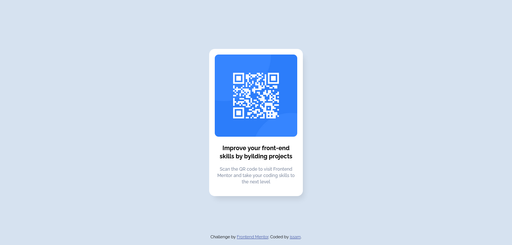

# Frontend Mentor - QR code component solution

This is a solution to the [QR code component challenge on Frontend Mentor](https://www.frontendmentor.io/challenges/qr-code-component-iux_sIO_H). Frontend Mentor challenges help you improve your coding skills by building realistic projects. 

## Table of contents

- [Overview](#overview)
  - [Screenshot](#screenshot)
  - [Links](#links)
- [My process](#my-process)
  - [Built with](#built-with)
  - [Useful resources](#useful-resources)
- [Author](#author)

## Overview

### Screenshot

### Links

- Solution URL: [https://github.com/issam-abdou/QR-code-component](https://github.com/issam-abdou/QR-code-component)
- Live Site URL: [https://issam-abdou.github.io/QR-code-component/](https://issam-abdou.github.io/QR-code-component/)

## My process

### Built with

- Semantic HTML5 markup
- CSS custom properties
- Flexbox

### Useful resources

- [box-shadow.dev](https://box-shadow.dev/) - i used this website to generate the box shadow for the card quickly.

## Author

- Frontend Mentor - [@issam-abdou](https://www.frontendmentor.io/profile/issam-abdou)

